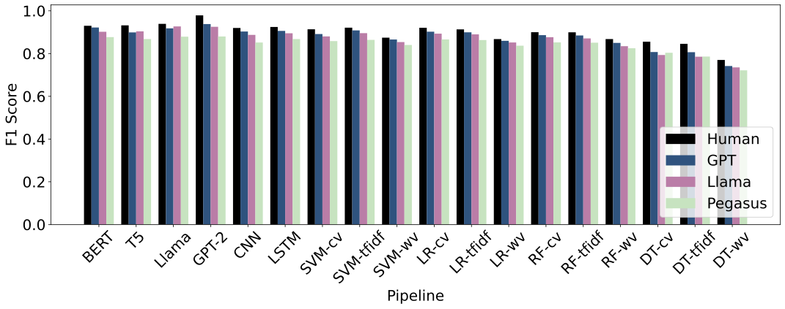
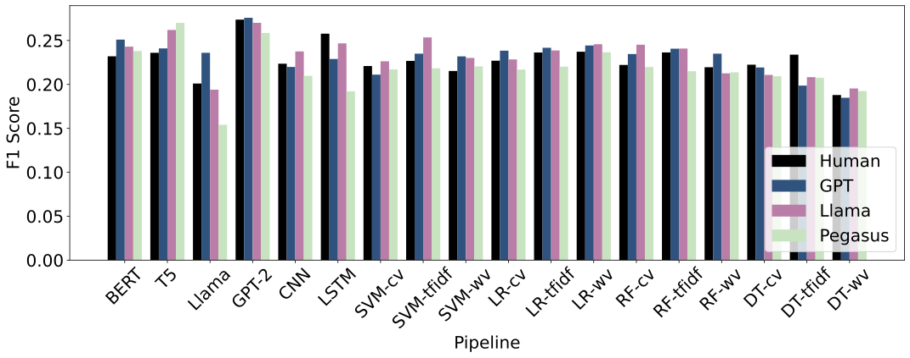
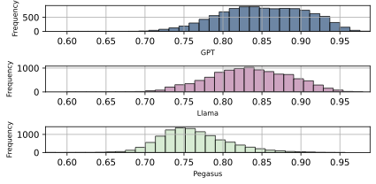
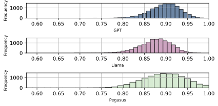
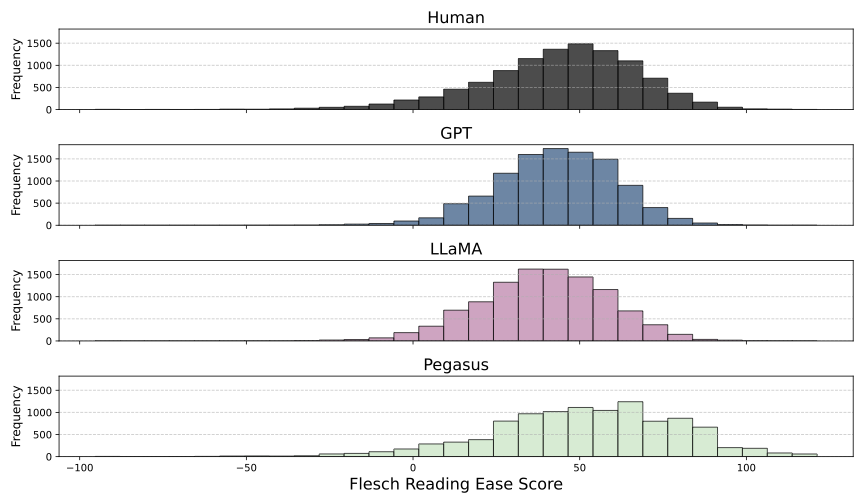
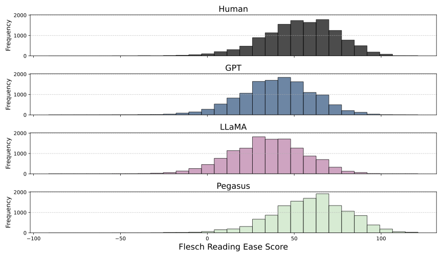
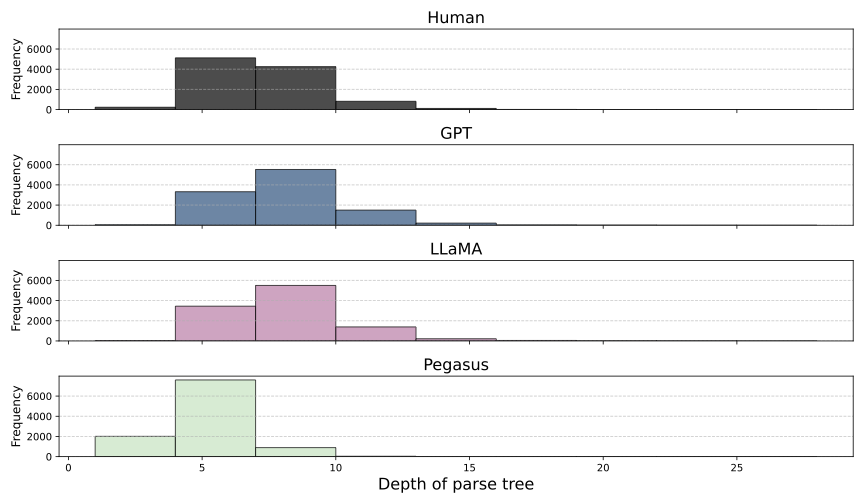
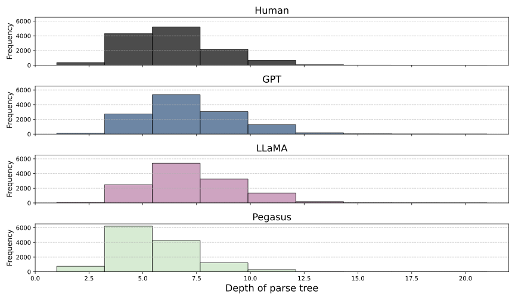
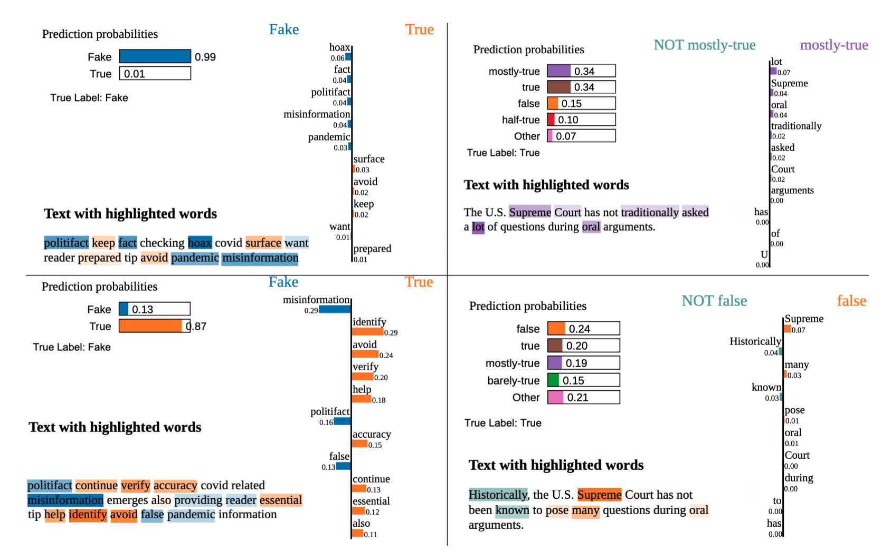

# Fake-News-Detection-After-LLM-Laundering

With their advanced capabilities, Large Language Models (LLMs) can generate highly convincing and contextually relevant fake news, which can contribute to disseminating misinformation. Though there is much research on fake news detection for human-written text, the field of detecting LLM-generated fake news is still under-explored. This research measures the efficacy of detectors in identifying LLM-paraphrased fake news, in particular, determining whether adding a paraphrase step in the detection pipeline helps or impedes detection. This study contributes: (1) Detectors struggle to detect LLM-paraphrased fake news more than human-written text, (2) We find which models excel at which tasks (evading detection, paraphrasing to evade detection, and paraphrasing for semantic similarity). (3) Via LIME explanations, we discovered a possible reason for detection failures: sentiment shift. (4) We discover a worrisome trend for paraphrase quality measurement: samples that exhibit sentiment shift despite a high BERTSCORE. (5) We provide a pair of datasets, augmenting existing datasets with paraphrase outputs and scores.

**Coding Description**

- **llama_fine-tune.py:** Contains the code to fine-tune a Llama model for text classification
- **Paraphrasing_using_PLMs.py:** Code to generate paraphrased text
- **sentiment analysis.py:** Code for sentiment analysis
- **linguistic_features.py:** Code for analyzing linguistic features
- **paraphrase_evaluation.py:** Code for evaluating paraphrasing text.
- **deep_learning.py:** Code for deep learning classification techniques
- **gpt_fine-tune_2.py:** Contains the code to fine-tune a GPT model for text classification
- **load_data.py:** Load the datasets
- **supervised_learning_2.py:** Code for supervised classification techniques
- **bert_classifier:** Contains the code to fine-tune a BERT model for text classification
- **T5_classifier:** Contains the code to fine-tune a T5 model for text classification
- **explainer_cnn_lstm:** Code for the LIME explainability

**Results**

***Human-writing vs Paraphrase:***

The results show that the detectors struggle to detect LLM-generated fake news more than human-written fake news. The classification performance for the human-written versus LLM paraphrased Covid-19 dataset is shown in Table 1. Figure 1 compares F1-scores among all the detectors.
|           | Human-written |       |       |       | GPT-generated |       |       |       | Llama-generated |       |       |       | Pegasus-generated |       |       |       |
|-----------|---------------|-------|-------|-------|---------------|-------|-------|-------|-----------------|-------|-------|-------|-------------------|-------|-------|-------|
| Pipeline  | Acc           | F1    | Pre   | Rec   | Acc           | F1    | Pre   | Rec   | Acc             | F1    | Pre   | Rec   | Acc               | F1    | Pre   | Rec   |
| BERT      | 0.93          | 0.93  | 0.93  | 0.93  | 0.922         | 0.922 | 0.922 | 0.922 | 0.902           | 0.902 | 0.902 | 0.902 | 0.877             | 0.877 | 0.877 | 0.877 |
| T5        | 0.93          | 0.932 | 0.94  | 0.93  | 0.899         | 0.899 | 0.901 | 0.899 | 0.904           | 0.904 | 0.904 | 0.904 | 0.868             | 0.868 | 0.871 | 0.868 |
| Llama     | 0.939         | 0.939 | 0.94  | 0.939 | 0.918         | 0.918 | 0.918 | 0.918 | 0.927           | 0.927 | 0.927 | 0.927 | 0.879             | 0.879 | 0.879 | 0.879 |
| GPT-2     | 0.979         | 0.979 | 0.979 | 0.979 | 0.938         | 0.938 | 0.939 | 0.938 | 0.925           | 0.925 | 0.925 | 0.925 | 0.88              | 0.88  | 0.88  | 0.88  |
| CNN       | 0.92          | 0.92  | 0.92  | 0.92  | 0.903         | 0.903 | 0.903 | 0.903 | 0.887           | 0.887 | 0.887 | 0.887 | 0.852             | 0.852 | 0.852 | 0.852 |
| LSTM      | 0.924         | 0.924 | 0.924 | 0.924 | 0.906         | 0.906 | 0.906 | 0.906 | 0.895           | 0.895 | 0.895 | 0.895 | 0.868             | 0.868 | 0.868 | 0.868 |
| SVM-cv    | 0.914         | 0.914 | 0.914 | 0.914 | 0.891         | 0.891 | 0.891 | 0.891 | 0.88            | 0.88  | 0.88  | 0.88  | 0.858             | 0.858 | 0.859 | 0.858 |
| SVM-tfidf | 0.921         | 0.921 | 0.921 | 0.921 | 0.908         | 0.908 | 0.908 | 0.908 | 0.896           | 0.896 | 0.896 | 0.896 | 0.864             | 0.864 | 0.864 | 0.864 |
| SVM-wv    | 0.874         | 0.874 | 0.874 | 0.874 | 0.866         | 0.866 | 0.866 | 0.866 | 0.854           | 0.854 | 0.854 | 0.854 | 0.84              | 0.84  | 0.841 | 0.84  |
| LR-cv     | 0.921         | 0.921 | 0.921 | 0.921 | 0.902         | 0.902 | 0.903 | 0.902 | 0.893           | 0.893 | 0.893 | 0.893 | 0.866             | 0.866 | 0.866 | 0.866 |
| LR-tfidf  | 0.913         | 0.913 | 0.914 | 0.913 | 0.899         | 0.899 | 0.9   | 0.899 | 0.89            | 0.89  | 0.89  | 0.89  | 0.863             | 0.863 | 0.863 | 0.863 |
| LR-wv     | 0.868         | 0.868 | 0.868 | 0.868 | 0.86          | 0.86  | 0.86  | 0.86  | 0.852           | 0.852 | 0.852 | 0.852 | 0.837             | 0.837 | 0.838 | 0.837 |
| RF-cv     | 0.9           | 0.9   | 0.9   | 0.9   | 0.886         | 0.886 | 0.886 | 0.886 | 0.877           | 0.877 | 0.877 | 0.877 | 0.852             | 0.852 | 0.855 | 0.852 |
| RF-tfidf  | 0.899         | 0.899 | 0.9   | 0.899 | 0.885         | 0.885 | 0.885 | 0.885 | 0.871           | 0.871 | 0.871 | 0.871 | 0.851             | 0.851 | 0.852 | 0.851 |
| RF-wv     | 0.868         | 0.868 | 0.871 | 0.868 | 0.85          | 0.85  | 0.852 | 0.85  | 0.835           | 0.835 | 0.837 | 0.835 | 0.825             | 0.825 | 0.828 | 0.825 |
| DT-cv     | 0.856         | 0.855 | 0.855 | 0.856 | 0.807         | 0.807 | 0.807 | 0.807 | 0.793           | 0.793 | 0.793 | 0.793 | 0.804             | 0.804 | 0.804 | 0.804 |
| DT-tfidf  | 0.846         | 0.846 | 0.846 | 0.846 | 0.807         | 0.806 | 0.808 | 0.807 | 0.785           | 0.785 | 0.785 | 0.785 | 0.786             | 0.786 | 0.786 | 0.786 |
| DT-wv     | 0.77          | 0.77  | 0.77  | 0.77  | 0.742         | 0.742 | 0.742 | 0.742 | 0.735           | 0.735 | 0.737 | 0.735 | 0.721             | 0.722 | 0.723 | 0.721 |

*Figure 1: Performance of fake news detectors on human-written and LLM-paraphrased text on the Covid-19 dataset.*

The classification performance for the human-written versus LLM paraphrased LIAR dataset is shown in Table 2. Figure 2 compares F1-scores among all the detectors.

|           | Human-written |       |       |       | GPT-generated |       |       |       | Llama-generated |       |       |       | Pegasus-generated |       |       |       |
|-----------|---------------|-------|-------|-------|---------------|-------|-------|-------|-----------------|-------|-------|-------|-------------------|-------|-------|-------|
| Pipeline  | Acc           | F1    | Pre   | Rec   | Acc           | F1    | Pre   | Rec   | Acc             | F1    | Pre   | Rec   | Acc               | F1    | Pre   | Rec   |
| BERT      | 0.251         | 0.232 | 0.238 | 0.251 | 0.266         | 0.251 | 0.272 | 0.266 | 0.256           | 0.243 | 0.276 | 0.256 | 0.256             | 0.238 | 0.27  | 0.256 |
| T5        | 0.274         | 0.236 | 0.312 | 0.274 | 0.277         | 0.241 | 0.303 | 0.277 | 0.265           | 0.262 | 0.264 | 0.265 | 0.272             | 0.27  | 0.275 | 0.272 |
| Llama     | 0.253         | 0.201 | 0.273 | 0.253 | 0.269         | 0.236 | 0.264 | 0.264 | 0.258           | 0.194 | 0.204 | 0.258 | 0.217             | 0.154 | 0.259 | 0.217 |
| GPT-2     | 0.279         | 0.274 | 0.279 | 0.279 | 0.28          | 0.276 | 0.276 | 0.28  | 0.273           | 0.27  | 0.272 | 0.273 | 0.26              | 0.259 | 0.26  | 0.26  |
| CNN       | 0.231         | 0.224 | 0.224 | 0.231 | 0.221         | 0.22  | 0.219 | 0.221 | 0.239           | 0.238 | 0.237 | 0.239 | 0.213             | 0.21  | 0.213 | 0.213 |
| LSTM      | 0.255         | 0.258 | 0.255 | 0.238 | 0.234         | 0.229 | 0.228 | 0.234 | 0.251           | 0.247 | 0.253 | 0.251 | 0.212             | 0.192 | 0.214 | 0.212 |
| SVM-cv    | 0.227         | 0.221 | 0.221 | 0.223 | 0.213         | 0.211 | 0.211 | 0.213 | 0.227           | 0.226 | 0.228 | 0.227 | 0.218             | 0.217 | 0.218 | 0.218 |
| SVM-tfidf | 0.238         | 0.23  | 0.229 | 0.231 | 0.242         | 0.235 | 0.245 | 0.242 | 0.259           | 0.254 | 0.26  | 0.259 | 0.226             | 0.218 | 0.221 | 0.226 |
| SVM-wv    | 0.214         | 0.165 | 0.228 | 0.198 | 0.248         | 0.232 | 0.245 | 0.248 | 0.243           | 0.23  | 0.245 | 0.243 | 0.235             | 0.221 | 0.229 | 0.235 |
| LR-cv     | 0.239         | 0.227 | 0.23  | 0.226 | 0.24          | 0.238 | 0.24  | 0.24  | 0.236           | 0.233 | 0.233 | 0.236 | 0.22              | 0.217 | 0.216 | 0.22  |
| LR-tfidf  | 0.238         | 0.213 | 0.233 | 0.215 | 0.25          | 0.242 | 0.252 | 0.25  | 0.244           | 0.239 | 0.25  | 0.244 | 0.228             | 0.22  | 0.219 | 0.228 |
| LR-wv     | 0.246         | 0.22  | 0.232 | 0.223 | 0.25          | 0.244 | 0.249 | 0.25  | 0.242           | 0.236 | 0.244 | 0.242 | 0.245             | 0.237 | 0.239 | 0.245 |
| RF-cv     | 0.25          | 0.222 | 0.261 | 0.227 | 0.253         | 0.235 | 0.249 | 0.253 | 0.268           | 0.256 | 0.277 | 0.268 | 0.227             | 0.22  | 0.223 | 0.227 |
| RF-tfidf  | 0.261         | 0.227 | 0.257 | 0.234 | 0.252         | 0.241 | 0.253 | 0.252 | 0.272           | 0.263 | 0.277 | 0.272 | 0.224             | 0.215 | 0.227 | 0.224 |
| RF-wv     | 0.231         | 0.204 | 0.267 | 0.207 | 0.253         | 0.235 | 0.249 | 0.253 | 0.226           | 0.213 | 0.234 | 0.226 | 0.227             | 0.214 | 0.225 | 0.227 |
| DT-cv     | 0.233         | 0.222 | 0.229 | 0.222 | 0.222         | 0.219 | 0.219 | 0.222 | 0.234           | 0.233 | 0.234 | 0.234 | 0.21              | 0.209 | 0.209 | 0.21  |
| DT-tfidf  | 0.201         | 0.192 | 0.193 | 0.193 | 0.204         | 0.199 | 0.197 | 0.204 | 0.199           | 0.197 | 0.197 | 0.199 | 0.209             | 0.208 | 0.207 | 0.209 |
| DT-wv     | 0.18          | 0.172 | 0.172 | 0.172 | 0.179         | 0.179 | 0.18  | 0.179 | 0.195           | 0.195 | 0.196 | 0.195 | 0.192             | 0.192 | 0.193 | 0.192 |

*Figure 2: Performance of fake news detectors on human-written and LLM-paraphrased text on the LIAR dataset.*

*** Semantic similarity of the paraphrased text ***

Figures 2 and 3 illustrate the semantic similarity distributions. We also measured effect sizes on the FBERT score between treatments (different paraphrasers). For the COVID-19 dataset, we find a small effect size between GPT and Llama (Hedge’s g, 0.34), which indicates a low difference in the semantic similarity between their paraphrased text outputs. In contrast, we find very large effect sizes between GPT and Pegasus (Hedge’s g, 1.78) and between Llama and Pegasus (Hedge’s g, 1.47). These results indicate that GPT and Llama produce paraphrases with practically significantly higher semantic similarity than Pegasus. For the LIAR dataset, we find negligible effects between Llama and non-GPT paraphrasers (Hedge’s g, g < .06), but a medium effect size between GPT and Llama (Hedge’s g, 0.60), which substantiates our observation about the superior FBERT scores that GPT paraphrases possess.

*Figure 3: Distribution of FBERT score for all paraphrasers on the COVID-19 dataset.*

*Figure 4: Distribution of FBERT score for all paraphrasers on the LIAR dataset.*

*** Readability score distribution of human-written text vs LLM-generated text  ***

Figures 5 and 6 show the readability score distribution for all four versions of the COVID-19 dataset and LIAR dataset respectively. 

*Figure 5: Distribution of Readability score for all paraphrasers on the COVID-19 dataset.*

*Figure 6: Distribution of Readability score for all paraphrasers on the LIAR dataset.*

***  Dependency parse tree depth distribution of human-written text vs LLM-generated text  ***

Figures 7 and 8 present the depth of the parse tree syntactic feature for the COVID-19 and LIAR datasets. 

*Figure 7: Distribution of Dependency parse tree depth for all paraphrasers on the COVID-19 dataset.*

*Figure 8: Distribution of Dependency parse tree depth for all paraphrasers on the LIAR dataset.*

*** Explainability outputs ***

*Figure 9: (Top Left): LIME output of the BERT model on human-written news (Bottom Left): LIME output of
the BERT model on Llama-paraphrased news (Top Right): LIME output of the LSTM model on human-written
news (Bottom Right): LIME output of the LSTM model on GPT-paraphrased news.*

